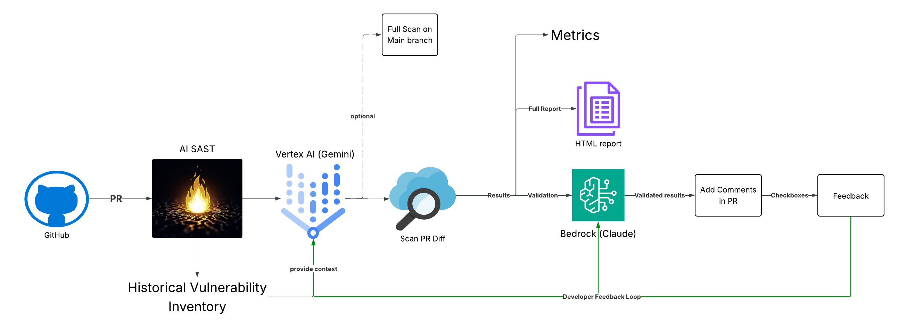

# AI-SAST - AI-Powered Static Application Security Testing

[](https://opensource.org/licenses/Apache-2.0)
[](https://www.python.org/downloads/)
[](https://github.com/features/actions)

AI-SAST is an AI-driven static application security testing tool. Run it in **your** repository on **your** runners—PR scan on pull requests, full scan on demand. Your code never runs on ai-sast infrastructure.

## Features

- **Vertex AI (Gemini)** (default), **AWS Bedrock (Claude Opus)**, or **Ollama** backends
- **PR scan**: Scans changed files on pull requests; posts findings as PR comments
- **Full scan**: Manual run to scan the entire repository
- **Your runners**: Workflow runs in your repo (e.g. self-hosted); your code stays on your infrastructure
- Multi-language support (Python, JS/TS, Java, Go, Rust, C/C++, and more)
- CVSS scoring, configurable exclusions, optional feedback loop

## Architecture



1. **Trigger**: Pull request or manual "Run workflow"
2. **Scan**: Code is analyzed by Vertex AI (Gemini), AWS Bedrock (Claude), or Ollama
3. **Results**: PR comments and HTML/text report artifacts

📖 [docs/ARCHITECTURE.md](docs/ARCHITECTURE.md)

## Integrate in your repository

1. **Copy the workflow file** into your repo as `.github/workflows/ai-sast.yml`:  
   [`.github/workflows/ai-sast.yml`](.github/workflows/ai-sast.yml)

2. **Add repository secrets** (Settings → Secrets and variables → Actions):  
   `GOOGLE_CLOUD_PROJECT`, `GOOGLE_CREDENTIALS`

The workflow checks out **`rivian/ai-sast`** at runtime. One file runs **PR scan** (on pull requests when base branch is `main`), **full scan** (manual "Run workflow"), and **feedback collection** (when someone edits a PR comment and checks a true/false positive box).

**Optional:** Set variable `AI_SAST_REPO` (e.g. for a fork); `AI_SAST_BASE_BRANCH` (default `main`); `runs-on: self-hosted` in the workflow for your own runners.

📚 **Full guide:** [docs/INTEGRATION.md](docs/INTEGRATION.md)

## Environment variables

All configuration is driven by environment variables. The table below lists supported variables, their description, and default value (if any). Set them as repository **Secrets** or **Variables** in GitHub (Settings → Secrets and variables → Actions), or in the workflow `env` block.

| Variable | Description | Default |
|----------|-------------|---------|
| **Workflow & scan behavior** | | |
| `AI_SAST_REPO` | GitHub repo to checkout (e.g. `org/ai-sast` or a fork). | `rivian/ai-sast` (in workflow) |
| `AI_SAST_BASE_BRANCH` | Branch that triggers PR scan; PRs targeting this branch are scanned. | `main` |
| `AI_SAST_SEVERITY` | Comma-separated severities to include in PR comments (e.g. `critical,high,medium`). | `critical,high` |
| `AI_SAST_EXCLUDE_PATHS` | Comma-separated path keywords to exclude from scanning (e.g. `test,vendor,mock`). | — |
| `AI_SAST_CUSTOM_PROMPT` | Extra instructions appended to the scan prompt (e.g. focus on certain vuln types). | — |
| `AI_SAST_STORE_FINDINGS` | When `true`, store scan findings (and validator results) in the database. | `false` |
| `AI_SAST_DB_PATH` | Path to SQLite database for feedback and optional scan storage. | `~/.ai-sast/scans.db` |
| **Initial scan LLM** | | |
| `AI_SAST_LLM` | LLM for the initial security scan: `vertex`, `bedrock`, or `ollama`. | `vertex` |
| `LLM_PROVIDER` | Legacy; same effect as `AI_SAST_LLM` when `AI_SAST_LLM` is not set. | `vertex` |
| `LLM_BACKEND` | Legacy; use `ollama` for local Ollama. | `vertex` |
| **Validator LLM** | | |
| `AI_SAST_VALIDATOR_LLM` | LLM to validate findings (true/false positive): `vertex`, `bedrock`, or `ollama`. Only validated true positives are posted in the PR. If unset or error, all findings are posted. | `bedrock` |
| `AI_SAST_VALIDATOR_BEDROCK_MODEL_ID` | Bedrock model used when validator is `bedrock`. | `anthropic.claude-3-5-sonnet-20241022-v2:0` |
| `AI_SAST_VALIDATOR_GEMINI_MODEL` | Gemini model used when validator is `vertex`. | same as `GEMINI_MODEL` |
| **Vertex AI (Google)** | | |
| `GOOGLE_CLOUD_PROJECT` | Google Cloud project ID (required for Vertex). | — |
| `GOOGLE_CREDENTIALS` | Service account JSON (secret); used by workflow for auth. | — |
| `GOOGLE_LOCATION` | Vertex AI region (e.g. `us-central1`). | `us-central1` |
| `GEMINI_MODEL` | Gemini model for initial scan when `AI_SAST_LLM=vertex`. | `gemini-2.5-pro` |
| `GOOGLE_APPLICATION_CREDENTIALS` | Path to service account key file (alternative to `GOOGLE_TOKEN`). | — |
| `GOOGLE_TOKEN` | Raw service account JSON or access token (alternative to file path). | — |
| **AWS Bedrock** | | |
| `AWS_REGION` | AWS region for Bedrock (e.g. `us-east-1`). | `us-east-1` |
| `BEDROCK_MODEL_ID` | Claude model for initial scan when `AI_SAST_LLM=bedrock`. | `anthropic.claude-opus-4-5-20251101-v1:0` |
| **Ollama (local)** | | |
| `OLLAMA_BASE_URL` | Ollama API base URL. | `http://localhost:11434` |
| `OLLAMA_MODEL` | Model name for scan or validator when using Ollama. | `qwen2.5-coder:14b` |
| **Jira (historical context)** | | |
| `JIRA_URL` | Jira server URL (e.g. `https://your.atlassian.net`). | — |
| `JIRA_USERNAME` | Jira user email. | — |
| `JIRA_API_TOKEN` | Jira API token (e.g. from id.atlassian.com). | — |
| `JIRA_JQL_QUERY` | JQL query to fetch vulnerability tickets for context. | — |
| **Feedback backend (Databricks)** | | |
| `AI_SAST_FEEDBACK_BACKEND` | Set to `databricks` to use Databricks instead of SQLite for feedback. | (SQLite) |
| `AI_SAST_DATABRICKS_HOST` | Databricks workspace hostname. | — |
| `AI_SAST_DATABRICKS_HTTP_PATH` | SQL warehouse HTTP path. | — |
| `AI_SAST_DATABRICKS_TOKEN` | Databricks personal access token. | — |
| `AI_SAST_DATABRICKS_CATALOG` | Unity Catalog name. | — |
| `AI_SAST_DATABRICKS_SCHEMA` | Schema name. | — |
| `AI_SAST_DATABRICKS_TABLE` | Table name for feedback. | — |
| **Webhook (notifications)** | | |
| `AI_SAST_WEBHOOK_URL` | Webhook endpoint URL for scan notifications. | — |
| `AI_SAST_WEBHOOK_SECRET` | Optional secret for HMAC signature. | — |
| `AI_SAST_WEBHOOK_TYPE` | Webhook format: `slack`, `teams`, `discord`, or `generic`. | `generic` |
| **Vector / logging** | | |
| `AI_SAST_VECTOR_URL` | Vector/log aggregator endpoint URL. | — |
| `AI_SAST_VECTOR_TOKEN` | Authentication token for the vector endpoint. | — |

*Secrets (e.g. `GOOGLE_CREDENTIALS`, `JIRA_API_TOKEN`, `AWS_ACCESS_KEY_ID`, `AWS_SECRET_ACCESS_KEY`) have no default and must be set in the repo.*

## Example PR comment

When the PR scan finds issues, it posts a comment like this:

```markdown
### 🤖 AI-SAST Security Scan
**2** potential issue(s) found.

> 💡 **Help us improve!** Use the checkboxes below to mark each finding as a true positive (✅) or false positive (❌).

| Severity | Count |
|---|---|
| 🔥 High | 2 |

---

<!-- vuln-id: abc12345 -->
- [ ] ✅ True Positive
- [ ] ❌ False Positive

**ID**: `abc12345`
**Severity**: High
**Issue**: SQL Injection vulnerability in user query
**Location**: `src/api/users.py:42`
**CVSS Vector**: `CVSS:3.1/AV:N/AC:L/PR:N/UI:N/S:U/C:H/I:H/A:N`

<details><summary>📋 Click to see details, risk, and remediation</summary>
**Risk:** Attacker could manipulate SQL queries...

**Validator proof:** User input is concatenated into the query without sanitization; a malicious payload could execute arbitrary SQL.

**Remediation:**
```
Use parameterized queries...
```
</details>
```

## Feedback loop

Developers can mark findings as **true positive** (✅) or **false positive** (❌) directly in the PR comment. That feedback is **stored in a database** (SQLite by default, or Databricks) and **included in the prompt sent to Vertex AI** on future scans so the model can improve accuracy (e.g. avoid repeating false positives and pay attention to patterns similar to confirmed vulnerabilities).

**How it works:**
1. **PR scan** posts a comment with checkboxes next to each finding.
2. **Developer** checks one box per finding (True Positive or False Positive).
3. **collect-feedback** workflow runs when the comment is edited and **stores feedback in the database**.
4. **Future scans** load that feedback and **add it to the Vertex AI (Gemini) prompt** as context, so the AI gets more accurate over time.

Feedback collection is included in the same workflow file (see Integrate in your repository). No extra configuration needed for SQLite.

📖 **Full guide:** [docs/FEEDBACK-LOOP.md](docs/FEEDBACK-LOOP.md)

## Troubleshooting

- **Auth errors:** Service account needs "Vertex AI User" role; `GOOGLE_CREDENTIALS` must be the full JSON key.
- **No PR comment:** Ensure the PR targets the branch set by `AI_SAST_BASE_BRANCH` (default `main`).
- **Feedback not triggering:** The feedback job runs from your **default branch** (e.g. `main`). Make sure `ai-sast.yml` is merged to that branch—if it only exists on a feature branch, checking boxes in the PR comment won’t trigger the workflow.
- **Using a fork:** Set repository variable `AI_SAST_REPO` to your `org/ai-sast`.

## Support

- 🐛 [Report bugs](../../issues)
- 💬 [Discussions](../../discussions)
- 📖 [Documentation](docs/)

---

Made with ❤️ by the AI-SAST community
